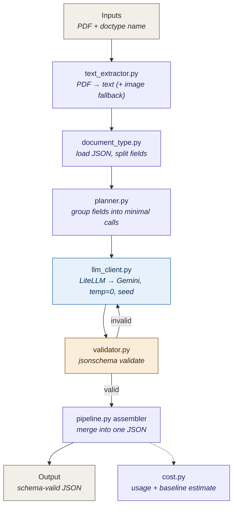
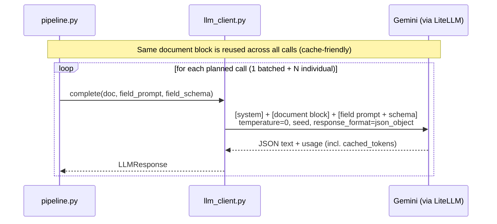
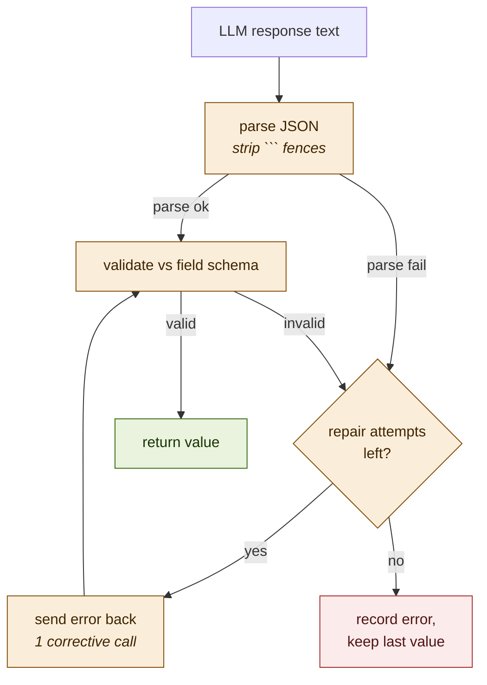

# Architecture

This document explains the design and logic of the extraction pipeline for
reviewers. All diagrams are Mermaid and render on GitHub / most Markdown viewers.

- **Goal:** `PDF + document type` → `JSON that conforms to the type's schema`.
- **Constraints we design for:** lower token cost than the per-key baseline,
  consistent output across repeated runs, and accuracy.

---

## 1. High-level pipeline

The pipeline is a straight line of small, single-responsibility stages. Inputs
enter at the top; a schema-valid JSON object leaves at the bottom.



The `invalid → E` edge is the **repair loop** (one retry, see §4).

---

## 2. How a document type is divided into fields → calls

This is the core cost decision. A *document type* is a list of *fields*. Each
field is either `general` (a simple string, empty schema) or `individual` (its
own large prompt + deep JSON schema).

- All `general` fields are **batched into one call**.
- Each `individual` field gets **its own call**.

Example — `Lease: Commercial` (8 fields → 4 calls instead of 8):

```mermaid
flowchart LR
    subgraph DT["Document type: Lease: Commercial (8 fields)"]
        direction TB
        subgraph GEN["general fields (strings)"]
            g1["effective_date"]
            g2["property_address"]
            g3["description"]
            g4["landlord_name"]
            g5["tenant_name"]
        end
        i1["consideration"]
        i2["consideration_review"]
        i3["key_dates"]
    end

    GEN --> C1["Batched call<br/><i>returns 5 strings</i>"]
    i1 --> C2["Consideration call<br/><i>rent / premium records</i>"]
    i2 --> C3["Review call<br/><i>rent review records</i>"]
    i3 --> C4["Key dates call<br/><i>term / date records</i>"]

    classDef gen fill:#E1F5EE,stroke:#0F6E56,color:#04342C;
    classDef ind fill:#EEEDFE,stroke:#534AB7,color:#26215C;
    classDef call fill:#E6F1FB,stroke:#185FA5,color:#042C53;
    class g1,g2,g3,g4,g5,GEN gen;
    class i1,i2,i3 ind;
    class C1,C2,C3,C4 call;
```

**Why:** general fields are cheap and share context, so batching them saves
calls with no accuracy loss. Individual fields carry 30k–87k-char prompts and
deep schemas, so merging them would blow context and cross-contaminate
instructions — each gets a dedicated call, but all calls reuse the same
(cacheable) document.

---

## 3. What one LLM call sends (cost + consistency logic)

Every call reuses an **identical leading document block**, so Gemini 2.5's
implicit prompt caching discounts it on calls 2..N. Only the small per-field
instruction changes.



Consistency levers, in order of impact:

1. `temperature=0` + fixed `seed`
2. schema-constrained JSON mode + **local `jsonschema` validation**
3. deterministic assembly — fields planned/emitted in a fixed sorted order
4. the repair loop (§4) converges on conforming output instead of retrying blindly

---

## 4. Validation and repair loop

Local validation (not just the provider's JSON mode) is the real guarantee that
output conforms — including `enum`, `required`, and `additionalProperties:false`,
which native structured-output modes often ignore.



Observed in a live run: the `consideration` call first returned
`amount_basis: "per annum"`, which violates the schema enum
(`yearly|quarterly|…`). Validation caught it, one repair call corrected it to
`"yearly"`, and the final output validated cleanly.

---

## 5. Module responsibilities

| Module | Responsibility | Key interface |
|---|---|---|
| `text_extractor.py` | PDF → text; image fallback for scanned pages only | `extract_document(pdf) -> DocumentContent` |
| `document_type.py` | Parse `document_types.json` into typed objects; split general/individual | `get_document_type(path, name) -> DocumentType` |
| `planner.py` | Group fields into the minimal set of calls | `plan_calls(doc_type) -> list[CallSpec]` |
| `llm_client.py` | LiteLLM wrapper: message assembly, JSON mode, temp/seed, usage | `LLMClient.complete(doc, prompt, schema) -> LLMResponse` |
| `validator.py` | Parse + schema-validate; build repair message | `parse_and_validate(text, schema) -> ValidationOutcome` |
| `pipeline.py` | Orchestrate stages, run repair loop, assemble result | `extract(pdf, doc_type) -> ExtractionOutput` |
| `cost.py` | Real usage accounting + per-key-baseline estimate | `Usage`, `estimate_baseline(...)` |
| `extract.py` | CLI; `--repeat N` consistency harness | — |

---

## 6. Cost model vs. the baseline

- **Baseline:** one call per field, re-sending **all page images** each time.
  Dominant cost ≈ `num_fields × num_pages × image_tokens_per_page`.
- **This pipeline:** send **text** (≈10–50× cheaper than images), **batch** the
  general fields (8→4 calls / 7→3), and **reuse** one cached document block.

`cost.py` reports real measured tokens/$ per run, plus an estimate of the
baseline on the same document, so the comparison is concrete rather than
asserted. Honest caveat: on the commercial lease the largest single token driver
is the per-field prompt itself (the `consideration` prompt is ~21k tokens) — the
baseline pays that too, so we still win via text-vs-image + batching + caching,
but prompt compression is the clear next lever.
```
